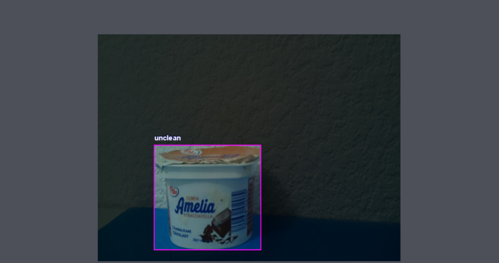
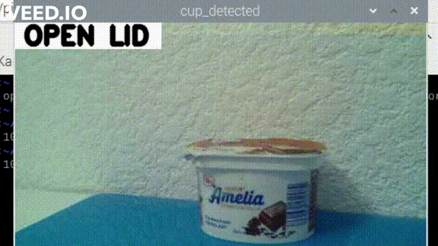
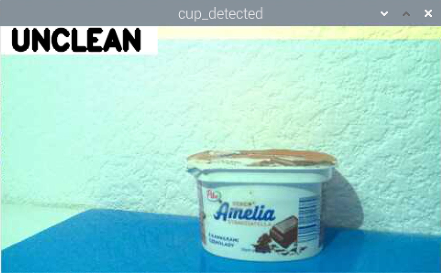

# Cup class detection project

See on YouTube: [Detection of damaged cup classes](https://www.youtube.com/watch?v=1_8iTiSo0Rg)

[](https://www.youtube.com/watch?v=1_8iTiSo0Rg)

## Main idea
The main concept is to create a system that would be used to check the quality of packaging of food products such as yoghurts or other food products on production lines. The project aims to automate the quality control process through an intelligent vision system based on image processing and Convolutional Neural Networks. The main task of the network would be to detect dirty, damaged and unmarketable items. Placing the camera next to the conveyor belt would allow the elimination of individual pieces of the product already at the stage of exiting the machine, before reaching the carton. 

The system control will be based on a Raspberry PI microcontroller with an additional camera. Further, a database will be created containing product photos that will be used to train the neural network model. In the first phase, the project will be implemented in a simulation test environment, and soon on the packing machine.
The considerations would focus on finding the most optimal conditions for the operation of the system, such as the use of additional light sources, appropriate structures of the neural network model and applications in an industrial environment. 

### Libraries
[](https://badge.fury.io/py/tensorflow)
[](https://badge.fury.io/py/tensorflow)

### Source Code
[](https://colab.research.google.com/github/tomaszsmaruj25/Cup_class_detection)

### First Attempt - object classification
See on YouTube: [Classification of damaged products](https://www.youtube.com/watch?v=bSiHZTzwNEM)

[](https://www.youtube.com/watch?v=bSiHZTzwNEM)


## TODO
#### Database
* [x] Create the first database (1000 photos, 4th class) 
* [x] Use Roboflow to store a database
* [x] Mark images with VOC labels
* [x] Complete the photo database - photos of cups with different labels, with and without lighting, photos on different backgrounds and in various configurations 
#### Model training 
* [x] Prepare your first CNN model
* [x] Use pretrained Models and google collab
* [x] Prepare scripts in Jupyter Notebook and Google Collab (for [TF2 Model Detection Zoo](https://colab.research.google.com/github/tomaszsmaruj25/Cup_class_detection/blob/main/Final_Train_TF2_detection_Zoo.ipynb), [Yolov4 Training](link), [TF2 Model Detection Zoo]](link)
#### Script for camera
* [x] Prepare script for camera in anaconda
* [x] Launch of the tflite model 
* [x] Show FPS number on the video stream
#### Testing and maintaining script on Raspberry PI 
* [x] Migrate model to RPI
* [x] Choose the most efficient solution - SSD Mobilenet v2 FPNLite 320x320
* [ ] Deploy an anti-crash solution and automatic script execution after restart
* [ ] Try to execute the script as a service and show video in the sample API (different project)
#### Finally
* [x] Earn a Master of Science degree :)


## Model Training
#### Install Object Detection API 

Download code
```bash
import os
import pathlib

# Clone the tensorflow models repository if it doesn't already exist
if "models" in pathlib.Path.cwd().parts:
  while "models" in pathlib.Path.cwd().parts:
    os.chdir('..')
elif not pathlib.Path('models').exists():
  !git clone --depth 1 https://github.com/tensorflow/models
```

Download code
```bash
# Install the Object Detection API
%%bash
cd models/research/
protoc object_detection/protos/*.proto --python_out=.
cp object_detection/packages/tf2/setup.py .
python -m pip install .
```

```bash
#run model builder test
!python /content/models/research/object_detection/builders/model_builder_tf2_test.py
```

### Performance
On test set

#### Resolution and FPS

| Detection model| EfficientDet | SSD MobileNet v2| SSD MobileNet v2 |
|----------------|--------------|-----------------|------------------|
| Resolution     | 512x512   | 640x640   | 320x320  |
| Avg. Accuracy  | 61.96   | 57.33   |         |
| FPS            | 61.96   | 57.33   |         |


## Example Factor - light.
Before applying light :



After applying light :



### References

  * YOLOv4: Optimal Speed and Accuracy of Object Detection [YOLOv4](https://arxiv.org/abs/2004.10934).
  * [link](link)
